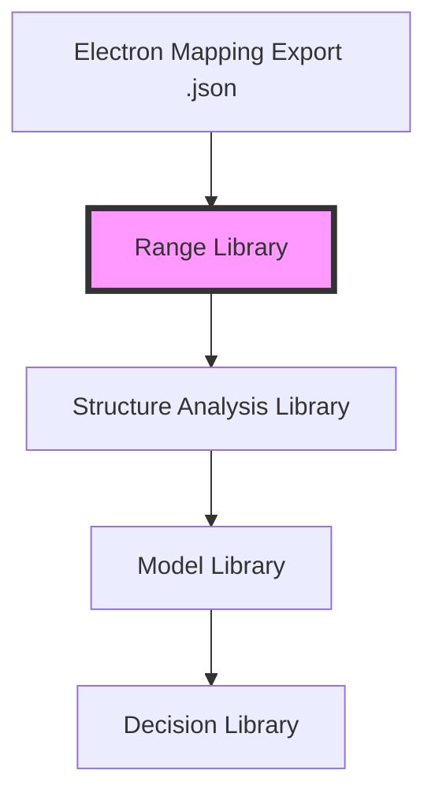

# Architecture Proposal: Python Range Library v0.1

## 1. Overview
The Range Library serves as the "Factual Base Layer" of the FX TrendMaster analytical stack. Its sole responsibility is to provide an immutable, normalized, and validated record of structural truth derived from Electron mapping exports.

## 2. Dependency Diagram
Strict one-way data flow ensures that factual records are never corrupted by analytical models or decision logic.



## 3. Folder Structure
Recommended organization within the `python/` directory:

```text
python/
    range_library/
        __init__.py       # Package entry point
        models.py         # Immutable Pydantic/Dataclass definitions
        ingest.py         # JSON loading and raw parsing
        normalize.py      # Field mapping and type conversion
        validate.py       # Non-mutating integrity rules
        report.py         # CLI output and metrics
        cli.py            # Command-line interface
        tests/
            test_ingest.py
            test_validate.py
```

## 4. Data Models
Using `pydantic` for strict type enforcement and optional immutability (`frozen=True`).

### RangeRecord
The primary unit of structural truth.
- `id`: `str` (Normalized UUID or numeric string)
- `symbol`: `str` (e.g., "XAUUSD")
- `layer`: `Enum` (MACRO, WEEKLY, DAILY, INTRADAY, MICRO)
- `high_price`: `Decimal`
- `low_price`: `Decimal`
- `start_time`: `datetime`
- `end_time`: `Optional[datetime]`
- `status`: `str` (ACTIVE, BROKEN, etc.)
- `parent_id`: `Optional[str]`

### RangeLink
Defines the relationships between records.
- `range_id`: `str`
- `parent_id`: `Optional[str]`
- `child_ids`: `List[str]`
- `prev_range_id`: `Optional[str]` (Temporal chain)
- `next_range_id`: `Optional[str]` (Temporal chain)

### ValidationIssue
- `range_id`: `str`
- `rule_code`: `str` (e.g., "ERR_TEMP_INV")
- `severity`: `Enum` (ERROR, WARNING, INFO)
- `message`: `str`

## 5. Normalization Philosophy
The library converts heterogeneous Electron JSON data into a uniform standard:
1.  **Price Precision**: All prices converted to `Decimal` to avoid floating-point errors.
2.  **Temporal Uniformity**: All ISO timestamps converted to UTC-aware `datetime` objects.
3.  **Field Aliasing**: `range_id` or `id` from JSON are mapped to a single `id` field.
4.  **Layer Normalization**: Mapping chart timeframes (W1, D1) to their logical structural layers.
5.  **Sorting**: Records are sorted by `start_time` globally upon ingestion to facilitate chain discovery.

## 6. Validation Philosophy (Non-Mutating)
Validation reports issues but **never** attempts to fix data. If a range is invalid, the Analytical libraries decide whether to exclude it.
- **Integrity**: Missing high/low prices, duplicate IDs.
- **Temporal**: Start time > End time; Start time in the future.
- **Hierarchical**: Child range start/end outside of Parent range start/end lifecycle.
- **Sequential**: A range marked "BROKEN" missing a subsequent "next_range_id" link.

## 7. Reporting & CLI Design
The CLI should provide a high-level health check of the library state.

**Example CLI Output:**
```text
FXTM Range Library v0.1 - [XAUUSD]
-----------------------------------------
TOTAL RANGES        : 1,250
DATE COVERAGE       : 2022-01-01 to 2024-03-15
ACTIVE RANGES       : 5
BROKEN RANGES       : 1,245

LAYER DISTRIBUTION:
- MACRO             : 12
- WEEKLY            : 48
- DAILY             : 210
- INTRADAY          : 980

VALIDATION SUMMARY:
[ERROR] 14 ranges missing parent_id
[ERROR] 2 broken chains detected (missing next_range_id)
[WARN]  8 orphans detected in non-MACRO layers
-----------------------------------------
```

## 8. Scalability Considerations
- **Memory**: Use of Python `generators` during ingestion to handle 50,000+ ranges without spikes.
- **Lookup Performance**: Maintaining an internal `id_map` (Dict[str, RangeRecord]) for O(1) retrieval.
- **Persistence**: While the source is JSON, the library should support a local `SQLite` or `Parquet` cache for high-speed analytical re-runs.

## 9. Potential Risks
- **Upstream Flux**: If Electron export formats change, `ingest.py` becomes the single point of failure (isolated risk).
- **Orphan Chains**: High fragmentation in mapping may lead to complex hierarchy trees that are difficult to visualize.
- **Timezone Mismatch**: Risk of UTC vs. Local time confusion if MT5 data is inconsistently exported.

## 10. Pre-Implementation Recommendations
1.  **Define a Unique Range Fingerprint**: Beyond IDs, create a hash of `(symbol, layer, high, low, start)` to detect duplicate mapping of the same structure.
2.  **Version the Export**: Add a `version` field to the JSON export to allow the library to handle legacy formats gracefully.
3.  **Strict Decimals**: Do not use `float` for prices; it will lead to "non-matching" price errors in parent-child validation.
