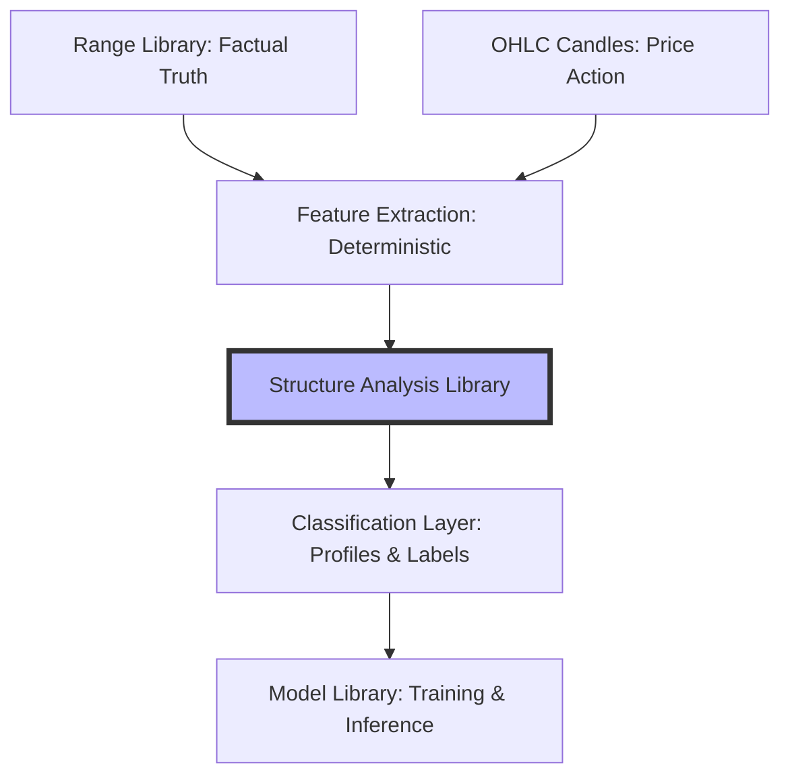

# Architecture Proposal: Structure Analysis Feature Catalogue v1

## 1. Purpose
The Structure Analysis Feature Catalogue defines the contract for deterministic data extraction from the Range Library. It transforms immutable structural facts (truth) into measurable metrics (information) that will serve as the primary features for future machine learning models and trading decision systems.

## 2. Dependency Diagram
The catalogue enforces a strict one-way flow. Analytical features depend on structural truth but never the reverse.

## 3. Feature Categories
To maintain modularity, features are grouped into logical domains:
- **Range Measurements**: Geometry and duration of the structure itself.
- **Parent/Child Hierarchy**: Relationship between layers (Macro, Weekly, Daily, etc.).
- **Chain Dynamics**: Sequential continuity between old and new ranges.
- **Retracement Analytics**: Depth and location of price within the structure.
- **Session & Time**: Temporal distribution across FX market sessions.
- **Liquidity & Interaction**: How price interacts with structural boundaries (RH/RL).
- **Momentum & Efficiency**: Velocity and quality of structural delivery.
- **Integrity & Quality**: Health metrics of the mapped data.

## 4. Feature Catalogue Table

| Feature Name | Description | Source | Input Requirements | Output Type | Det. | Ver. | Belongs To |
| :--- | :--- | :--- | :--- | :--- | :---: | :--- | :--- |
| **range_size_points** | H-L distance in points | Range Lib | RH/RL Price | Number | Yes | v0.1 | Analysis |
| **range_size_percent** | (H-L)/L percentage | Range Lib | RH/RL Price | Percent | Yes | v0.1 | Analysis |
| **duration_minutes** | Total lifecycle length | Range Lib | Start/End Time | Number | Yes | v0.1 | Analysis |
| **high_to_low_seq** | High vs Low temporal order | Range Lib | RH/RL Time | Enum | Yes | v0.1 | Analysis |
| **range_dir_from_bos** | Trend direction | Range Lib | BOS Type | Enum | Yes | v0.1 | Analysis |
| **active_duration** | Duration in ACTIVE status | Range Lib | Start/Inactive Time| Number | Yes | v0.1 | Analysis |
| **child_count** | Total mapped children | Child Ranges | Child IDs | Number | Yes | v0.1 | Analysis |
| **child_overlap_ratio**| % of parent duration covered | Child Ranges | Child Start/End | Percent | Yes | v0.1 | Analysis |
| **front_gap_minutes** | Gap before first child | Child Ranges | Parent/Child Start | Number | Yes | v0.1 | Analysis |
| **middle_gap_count** | Mapping gaps between children | Child Ranges | Children Start/End | Number | Yes | v0.1 | Analysis |
| **tail_gap_minutes** | Gap after last child | Child Ranges | Parent/Child End | Number | Yes | v0.1 | Analysis |
| **parent_price_overlap**| % of child inside parent H/L| Parent Range | Parent/Child H/L | Percent | Yes | v0.1 | Analysis |
| **chain_depth** | Position in temporal chain | Range Lib | Chain Links | Number | Yes | v0.1 | Analysis |
| **chain_cont_status** | Continuity health | Range Lib | Chain IDs | Enum | Yes | v0.1 | Analysis |
| **retrace_depth_pct** | Max retrace before BOS | OHLC + Range | BOS, OHLC | Percent | Yes | v0.1 | Analysis |
| **retrace_duration** | Time spent retracing | OHLC + Range | OHLC | Number | Yes | v0.1 | Analysis |
| **premium_discount** | Final retrace location | OHLC + Range | OHLC | Enum | Yes | v0.1 | Analysis |
| **session_of_rh** | FX Session for Range High | Range+Calendar| RH Time | Enum | Yes | v0.1 | Analysis |
| **session_of_rl** | FX Session for Range Low | Range+Calendar| RL Time | Enum | Yes | v0.1 | Analysis |
| **session_of_bos** | FX Session for BOS | Range+Calendar| BOS Time | Enum | Yes | v0.1 | Analysis |
| **day_of_week_bos** | Weekday of BOS event | Range Lib | BOS Time | Enum | Yes | v0.1 | Analysis |
| **high_visit_count** | Tests of RH boundary | OHLC + Range | OHLC | Number | Yes | v0.1 | Analysis |
| **low_visit_count** | Tests of RL boundary | OHLC + Range | OHLC | Number | Yes | v0.1 | Analysis |
| **sweep_high_count** | Fake-outs above RH | OHLC + Range | OHLC | Number | Yes | v0.1 | Analysis |
| **reclaim_high_count** | Successful reclaims of RH | OHLC + Range | OHLC | Number | Yes | v0.1 | Analysis |
| **range_efficiency** | Trending quality ratio | OHLC + Range | OHLC | Percent | Yes | v0.1 | Analysis |
| **displacement_size** | Pips moved during impulse | OHLC + Range | OHLC | Number | Yes | v0.1 | Analysis |
| **candles_to_break** | Bar count to BOS | OHLC + Range | OHLC | Number | Yes | v0.1 | Analysis |
| **missing_rh_rl** | Integrity: Anchors present? | Range Lib | Field Check | Boolean | Yes | v0.1 | Analysis |
| **invalid_time_order** | Integrity: Start < End? | Range Lib | Field Check | Boolean | Yes | v0.1 | Analysis |
| **suspicious_micro** | Lifecycle too short? | Range Lib | Duration/Layer | Boolean | Yes | v0.1 | Analysis |
| **retrace_profile** | Classify retrace shape | Analysis Lib | Derived Metrics | Enum | No | Future | Hook |
| **continuation_cand** | Entry signal candidate | Model Lib | Analysis Record | Boolean | No | Future | Model |
| **injection_cand** | Institutional move detect | Analysis Lib | Momentum/Volume | Boolean | No | Future | Hook |

## 5. v0.1 Minimum Viable Feature Set
1.  **Core Geometry**: `range_size_points`, `duration_minutes`, `high_to_low_seq`.
2.  **Hierarchy**: `parent_range_id`, `child_count`, `parent_price_overlap`.
3.  **Temporal**: `session_of_rh`, `session_of_rl`, `day_of_week_bos`.
4.  **Integrity**: `missing_rh_rl`, `missing_bos`, `invalid_time_order`.

## 6. Future Feature Set (Classification Hooks)
Interpretation-heavy labels implemented after the deterministic layer is stabilized:
- `retracement_profile_candidate`: Labels based on retrace speed and depth (e.g. `V_SHAPE`, `FLAG`).
- `exhaustion_candidate`: Momentum loss signals near boundaries.
- `sweep_reclaim_candidate`: Recognition of liquidity grab patterns.

## 7. Features Explicitly Out of Scope
- **Trade Execution**: Entry/Exit prices, stop-loss placement, R:R.
- **AI/ML Training**: This catalogue defines *inputs*, not the *models*.
- **Live Detection**: Analyzes *mapped* ranges; real-time candle detection is separate.
- **Manual Mutation**: No ability to edit factual records.

## 8. Implementation Recommendations for Codex
- **Strict Decimals**: Use `Decimal` for all currency/percentage math.
- **Timezone Isolation**: Force all timestamps to UTC/GMT standard.
- **Vectorized Scans**: Use `numpy` for OHLC iteration to support 50k+ records.
- **Schema Enforcement**: Use Pydantic to validate Range Library inputs.

## 9. Risks & Unknowns
- **OHLC Continuity**: Missing candles will skew visit counts and retracement depth.
- **Layer Overlap**: Ambiguity between Major/Minor ranges requires strict filtering.
- **Session Drift**: DST shifts require a robust GMT-based market calendar.

## 10. Proposed Test Fixture Requirements
- **Perfect Range**: Complete data, no validation errors.
- **Orphan Range**: No parent, should be measurable but flagged.
- **Deep Retrace**: Price visits extreme discount/premium before BOS.
- **Multi-Sweep**: Boundaries spiked multiple times.
- **Broken Chain**: Temporal series missing a link.
- **Micro-Lifecycle**: Range lasting only 2-3 candles.
