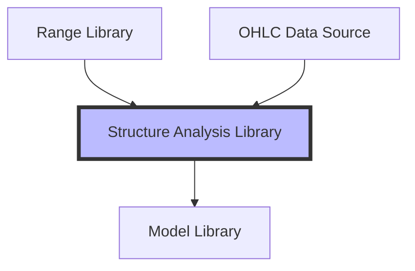

# Architecture Proposal: Structure Analysis Library v0.1

## 1. Overview
The Structure Analysis Library is the analytical engine of the FXTM stack. It sits above the Range Library and derives deterministic measurements and classifications from structural truth. Its goal is to quantify "what happened" within a range, providing a rich feature set for future model development.

## 2. Dependency Diagram
Data flows strictly one-way. Analytics never modify the factual records.



## 3. Folder Structure
Recommended organization within `python/structure_analysis/`:

```text
python/
    structure_analysis/
        __init__.py
        models.py           # Analysis dataclasses (linked to Range ID)
        engines/            # Domain-specific measurement logic
            retracement.py  # Impulse/Retrace depths
            sessions.py     # Time-of-day/Session logic
            liquidity.py    # Price interaction with boundaries
            momentum.py     # Velocity and efficiency
            hierarchy.py    # Child density and parent overlap
        pipeline.py         # Orchestration of analytical runs
        report.py           # CLI and aggregate statistics
        integrations/       # RangeLibrary data loaders
        tests/
```

## 4. Analysis Pipeline
The pipeline is stateless and reproducible:
1.  **Discovery**: Load validated `RangeRecords` from Range Library for a specific symbol/timeframe.
2.  **Contextualization**: Link ranges to their parents, children, and temporal siblings.
3.  **Data Fetch**: Load the underlying OHLC candles corresponding to the range's lifecycle.
4.  **Measurement**: Run domain engines to populate analytical sub-models.
5.  **Aggregation**: Generate symbol-level reports or feature sets for Model Library.

## 5. Data Models
Analytical records are linked to `RangeRecord.id` but stored separately.

### StructureAnalysisRecord
Aggregate container for all measurements of a single range.
- `range_id`: `str`
- `retracement`: `RetracementAnalysis`
- `session`: `SessionAnalysis`
- `liquidity`: `LiquidityVisitAnalysis`
- `momentum`: `MomentumAnalysis`
- `hierarchy`: `HierarchyAnalysis`

### Domain Models (Examples)
- **RetracementAnalysis**: `impulse_span_pips`, `retracement_depth_percent`, `deep_mid_shallow_label`.
- **SessionAnalysis**: `rh_session`, `rl_session`, `bos_session` (LONDON, NY, ASIA).
- **LiquidityVisitAnalysis**: `rh_visit_count`, `rl_visit_count`, `sweep_detection_flag`.
- **HierarchyAnalysis**: `child_density` (count per duration), `parent_overlap_percent`.

## 6. Analytical Features
The library will support calculating the following features:
- **Range Efficiency**: Actual price travel vs. range size (O-C / H-L).
- **Structure Completeness**: Score based on presence of all sub-components (RH, RL, BOS).
- **Time spent active**: Duration before break.
- **Momentum**: Average pips per minute during impulse phase.

## 7. Reporting & CLI
The library provides high-level insights via CLI:
- **Symbol Summary**: Average range size, average duration, session distribution heatmaps.
- **Validation Audit**: Identification of "sparse" ranges with insufficient child data.
- **Export**: JSON/Parquet export of analytical features for machine learning.

## 8. Validation Philosophy
Analysis validation checks the *validity of calculation*:
- Ensure candles exist for the entire range lifecycle.
- Flag "Price Mismatches" where factual RH/RL prices do not align with loaded OHLC.
- Identification of "Unmeasurable" ranges (e.g., duration too short for session analysis).

## 9. Future Extension Points (Plugs)
- **Model Library Hook**: The `Classification` layer will allow Model Library to add "Trading Labels" (e.g., `is_valid_entry`) to AnalysisRecords without modifying the measurement code.
- **Live Detector Integration**: The pipeline is designed to analyze partial/unbroken ranges in real-time.

## 10. Scalability & Risks
- **Scalability**: Analysis is vectorized using `pandas/numpy` where possible to handle 50,000+ ranges in seconds.
- **Risks**:
    - **OHLC Continuity**: Missing candle data will break measurement engines.
    - **Floating Point**: Retracement percentages must use standardized rounding to ensure reproducibility.
    - **Timezone complexity**: Session analysis requires strict adherence to FX market hours (GMT/UTC standard).

## 11. Recommendations
1.  **Strict Determinism**: Re-running the pipeline after deleting results *must* produce identical analytical records.
2.  **Separate DB/Files**: Store `AnalysisRecords` in a different storage bucket than `RangeRecords` to enforce separation of concerns.
3.  **Decoupled OHLC**: Allow the library to use multiple OHLC sources (local DB, CSV, API) through an interface.
