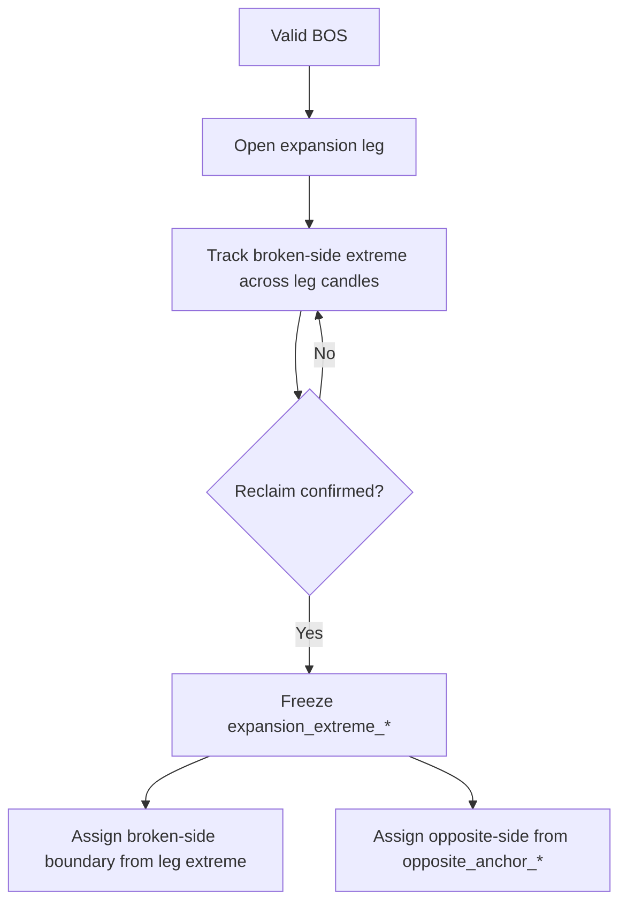

# HTF Leg-Based Range Doctrine

**Status:** PLAN ONLY — not implemented  
**Date:** 2026-06-17  
**Scope:** Planning document for leg-based HTF range detection. Defines how expansion and reclaim **legs** determine RH/RL — not individual candles, swings, or BOS-bar defaults.

**Out of scope:** Detector code, `RANGE_V2` implementation, boundary logic, Electron UI, backend API, stats/analytics.

---

## 0. Why this document exists

2025 XAUUSD W1 audit research (`detector_audit_4750e5ac`, 12 EDIT weeks) shows a systematic mismatch:

| Question | Detector habit | Josh mapping |
|----------|----------------|--------------|
| RH source | BOS-bar high (`retracement_impulse_high`) | Expansion-leg extreme before reclaim |
| RL source | Post-BOS retrace low (`retracement_impulse_low`) | Opposite-side anchor (`range_start`) |
| Unit of structure | Candle / swing / bar extreme | **Leg** (expansion → reclaim) |

**Audit percentages (12 EDIT weeks):**

| RH hypothesis | Match |
|---------------|-------|
| BOS high (price) | 2 / 12 (16.7%) |
| Ref high (time on ref week) | 0 / 12 (0.0%) |
| Expansion-leg high (pre-reclaim, not BOS-bar) | 10 / 12 (83.3%) |
| RH time before reclaim | 12 / 12 (100%) |
| RH time on `range_end` week | 12 / 12 (100%) |

| RL hypothesis | Match |
|---------------|-------|
| Opposite-swing / `range_start` (time) | 12 / 12 (100%) |
| Ref low (ref week time) | 0 / 12 (0.0%) |
| Pullback/reclaim low (detector retrace anchors) | 2 / 12 (16.7%) |

**Conclusion:** The detector thinks in candles. Josh maps **expansion leg → reclaim leg**. Forcing `max(bos_high, ref_high)` or default BOS-bar ownership solves the wrong problem.

This document supersedes candle-ownership as the **primary** framing in `HTF_REFERENCE_STRUCTURE_DOCTRINE.md` for boundary selection. Reference-structure vocabulary (BOS candle, ref candle) remains valid as **participants inside legs**, not as the range unit itself.

**Gate:** No implementation until Josh reviews this plan.

---

## 1. Expansion leg

### 1.1 Definition

An **expansion leg** is the directional price movement that begins after a **valid BOS** of old structure and continues until **reclaim or reaction confirms leg completion**.

It is a **time-bounded market segment**, not a single candle.

```text
Old container (RH/RL)
  → BOS (structure break event)
  → Expansion leg (displacement in break direction)
  → Leg completion signal (reclaim touch/close or qualifying reaction)
```

### 1.2 Leg boundaries (market time)

| Boundary | Rule |
|----------|------|
| **Start** | First market time at or after accepted BOS (wick break of old broken boundary). |
| **End** | Market time of **reclaim confirmation** (close back inside old boundary) or doctrine-qualified reaction that freezes the expansion extreme. Wick contact alone starts reclaim leg tracking but does not necessarily end expansion extreme hunting until confirmation policy locks the leg. |

### 1.3 Broken-side boundary from expansion leg

The **broken-side** range boundary (RH on bullish BOS UP, RL on bearish BOS DOWN) is taken from the **expansion-leg extreme** — the highest (bullish) or lowest (bearish) **valid** price reached during the expansion leg **before** leg completion is confirmed.

**Hard rules:**

- The extreme is **leg-owned**, not candle-owned by default.
- The extreme must be **pre-reclaim confirmation** (audit: Josh RH time before reclaim in 12/12 weeks).
- The extreme time anchor aligns with **`range_end`** in the 2025 audit (12/12) — the last week of expansion before reclaim week.

### 1.4 What is *not* the expansion leg

| Object | Status |
|--------|--------|
| Post-reclaim continuation | Separate leg / next cycle |
| Retracement measurement window only | Detector artifact, not leg definition |
| Latest swing high/low globally | Non-doctrinal |
| `max(bos_high, ref_high)` | Candle math, not leg semantics |

---

## 2. Reclaim leg

### 2.1 Definition

A **reclaim leg** is the pullback / reaction that follows the expansion leg when price returns toward (and optionally through) the old broken boundary.

```text
Expansion leg completes (extreme locked)
  → Reclaim leg (counter-move toward old boundary)
  → Reclaim confirmation (close inside old boundary per HTF contract)
  → New container rebased OR current-leg state updated
```

### 2.2 Role in range formation

| Function | Detail |
|----------|--------|
| **Confirms** | Expansion leg is complete; displacement was real enough to invite reaction. |
| **Defines current leg state** | While reclaim leg is active, the system is in `RECLAIM` (or `RECLAIMED_*` lifecycle), not still hunting expansion extremes. |
| **Tradable counter-leg** | Reclaim leg may be tradable **against** the main / all-time trend while it remains the active leg — even when higher-timeframe bias is opposite. |

### 2.3 Reclaim leg vs opposite anchor (RL on bullish)

Audit evidence (12/12): Josh’s **RL** anchors on **`range_start`** (opposite-side week), not on reclaim-leg low in the correction export.

**Planning distinction:**

| Concept | Audit role (2025 W1) | Chart / live mapping role |
|---------|----------------------|---------------------------|
| **Opposite anchor** | RL price + time = `range_start` (100%) | Non-broken-side floor linked to prior structure |
| **Reclaim leg extreme** | Not the promoted RL in corrections | May still describe live pullback geometry and tradable counter-leg |

**Do not collapse** reclaim-leg geometry and opposite-anchor selection without further audit slices. This plan records both; 2025 corrections favor **opposite anchor** for durable RL.

### 2.4 Tradability note

Reclaim leg as a **tradable counter-trend leg** is a **workflow / execution** concern, not a detector storage rule. The detector may trace reclaim-leg extrema in `meta_json` without promoting them to RH/RL when doctrine says opposite anchor owns the non-broken side.

---

## 3. Boundary ownership

Boundary ownership is **leg-first**. Candles (BOS, ref, swings) are candidates **inside** the leg; the leg extreme wins.

### 3.1 Bullish transition (BOS UP — broken `HIGH`)

| Boundary | Owner | Rule |
|----------|-------|------|
| **RH** | Expansion leg | Highest valid expansion-leg extreme **before** reclaim confirmation. |
| **RL** | Opposite-side anchor | Linked opposite low at `range_start` / structural floor — **not** detector retrace low by default. |

```text
RH = expansion_extreme_high (pre-reclaim)
RL = opposite_anchor_low (range_start)
```

### 3.2 Bearish transition (BOS DOWN — broken `LOW`)

| Boundary | Owner | Rule |
|----------|-------|------|
| **RL** | Expansion leg | Lowest valid expansion-leg extreme **before** reclaim confirmation. |
| **RH** | Opposite-side anchor | Linked opposite high at `range_start` / structural ceiling. |

```text
RL = expansion_extreme_low (pre-reclaim)
RH = opposite_anchor_high (range_start)
```

### 3.3 Ownership decision flow



### 3.4 Audit alignment

| Rule | 2025 audit support |
|------|-------------------|
| RH from expansion leg | 10/12 price; 12/12 time pre-reclaim |
| RH from BOS bar only | 2/12 |
| RH from ref candle | 0/12 |
| RL from opposite anchor | 12/12 time on `range_start` |
| RL from reclaim/retrace low | 2/12 (detector habit, rejected on WRONG_RL edits) |

---

## 4. BOS candle role

The BOS candle is an **event candle**, not the default boundary owner.

| Role | Description |
|------|-------------|
| **Event marker** | Records that old structure was breached (wick break at HTF). |
| **Leg opener** | Starts the expansion leg clock. |
| **Candidate extreme** | **May** own the expansion-leg extreme **if** its high (bullish) or low (bearish) is the highest/lowest valid price in the leg before reclaim confirmation. |
| **Non-owner by default** | Must **not** automatically become RH/RL. Audit: 10/12 RH edits where BOS-bar price ≠ Josh RH. |

**Example 1 (screenshot pattern — BOS owns):** BOS candle prints the highest point of the expansion leg; reclaim follows; RH = BOS candle high. **Supported in audit** (~17% by price, ~one bullish week clearly).

**Counter-example (audit 2025-06-15):** BOS-bar high > Josh RH — expansion-leg extreme is an **earlier** valid high inside the leg, not the BOS bar.

---

## 5. Ref candle role

The ref candle is a **context / confirmation candle**, not the default boundary owner.

| Role | Description |
|------|-------------|
| **Reaction slot** | First qualifying reaction bar after BOS (often `bos_index + 1`). |
| **Participation** | May engulf, inside-bar, sweep, or shallow reject — still part of structure narrative. |
| **Confirmation context** | Supports reclaim watch; does not imply BOS/reclaim/rebase by itself (per Electron HTF core contract). |
| **Conditional owner** | Owns the broken-side boundary **only if** it prints the expansion-leg extreme before reclaim confirmation. |

**Example 2 (screenshot pattern — ref owns):** BOS up → continuation → ref candle higher high → pullback. RH = ref candle high. **Valid doctrinally** but **not observed** in 2025 W1 corrections (0/12 ref-week RH time).

**Default in audit:** ref is observational; expansion-leg extreme is elsewhere in the leg (often `range_end` week).

---

## 6. Reclaim role

### 6.1 Leg completion

Reclaim **confirms expansion leg completion**:

- Wick contact (`RECLAIM_TOUCH`) begins reclaim-leg tracking.
- Close inside old boundary (`RECLAIM_CLOSE`) confirms per `RANGE_V2_DOCTRINE_CONTRACT.md`.

After confirmation, the expansion-leg extreme is **frozen** — no later candle may revise the broken-side boundary for that cycle.

### 6.2 Current leg state

Reclaim establishes **current leg state** for the active HTF cycle:

| State | Meaning |
|-------|---------|
| `EXPANSION` | Hunting expansion-leg extreme; reclaim not yet confirmed. |
| `RECLAIM` | Reclaim leg active; expansion extreme frozen. |
| `RECLAIMED_*` | Reclaim confirmed; container ready for rebase / opposite boundary linkage. |
| `CONTINUATION` | Post-reclaim movement in break direction (next expansion or failure). |
| `ABANDONED` | Leg/range abandoned per doctrine. |

### 6.3 Tradable counter-leg

While reclaim leg is active, it may be **tradable against** the main / all-time trend. That is a **trader workflow** fact; durable RH/RL still come from expansion extreme + opposite anchor per §3.

### 6.4 “Reclaim becomes the low” (chart teaching)

On charts Josh often describes reclaim defining the **pullback floor**. In the **2025 correction export**, promoted RL tracked **opposite anchor** (`range_start`), not reclaim-leg low. Future audit passes should test reclaim-leg low as RL on new samples before changing §3 defaults.

---

## 7. Required future `meta_json` trace

Every leg-aware `RANGE_V2` suggestion should carry a block like:

```json
"htf_leg_trace": {
  "schema_version": "htf_leg_trace_v1",
  "source_timeframe": "W1",
  "structure_layer": "WEEKLY",
  "broken_boundary": "HIGH",
  "bos_direction": "UP",

  "expansion_leg_start_time_ms": 1736035200000,
  "expansion_leg_end_time_ms": 1736640000000,
  "expansion_extreme_price": 2726.06,
  "expansion_extreme_time_ms": 1736035200000,
  "expansion_extreme_owner": "IMPULSE_SWING",

  "reclaim_leg_start_time_ms": 1736640000000,
  "reclaim_leg_extreme_price": 2656.66,
  "reclaim_leg_extreme_time_ms": 1736640000000,

  "current_leg_state": "RECLAIMED_DOWN",

  "opposite_anchor_price": 2586.4,
  "opposite_anchor_time_ms": 1735430400000
}
```

### 7.1 Field definitions

| Field | Required | Meaning |
|-------|----------|---------|
| `expansion_leg_start_time_ms` | Yes | Market time expansion leg opens (at/after BOS). |
| `expansion_leg_end_time_ms` | Yes | Market time expansion leg freezes (reclaim confirmation). |
| `expansion_extreme_price` | Yes | Broken-side extreme price from expansion leg. |
| `expansion_extreme_time_ms` | Yes | Market time of that extreme. |
| `expansion_extreme_owner` | Yes | `BOS_CANDLE` \| `REF_CANDLE` \| `IMPULSE_SWING` — which candidate owned the leg extreme. |
| `reclaim_leg_start_time_ms` | Yes | When reclaim leg tracking begins (often reclaim touch). |
| `reclaim_leg_extreme_price` | Yes | Deepest pullback (bullish) or highest reaction (bearish) during reclaim leg — **trace only** unless doctrine promotes to RL/RH. |
| `reclaim_leg_extreme_time_ms` | Yes | Market time of reclaim-leg extreme. |
| `current_leg_state` | Yes | `EXPANSION` \| `RECLAIM` \| `CONTINUATION` \| `ABANDONED` (+ mapped `RECLAIMED_*` lifecycle). |
| `opposite_anchor_price` | Yes | Non-broken-side boundary price (`range_start` anchor). |
| `opposite_anchor_time_ms` | Yes | Market time of opposite anchor. |

### 7.2 Mapping to existing RANGE_V2 fields

| Leg trace | Existing / planned field |
|-----------|--------------------------|
| `expansion_extreme_price` (bullish) | `suggested_rh` |
| `expansion_extreme_price` (bearish) | `suggested_rl` |
| `opposite_anchor_price` | `suggested_rl` (bullish) / `suggested_rh` (bearish) |
| `expansion_extreme_owner` | supersedes `selected_rh_source` / `selected_rl_source` candle framing |
| `current_leg_state` | `lifecycle_state` + leg overlay |
| `expansion_leg_*` | aligns with `range_end_time` / `range_start_time` in audit |

### 7.3 Enum: `expansion_extreme_owner`

| Value | When |
|-------|------|
| `BOS_CANDLE` | BOS bar printed the leg extreme. |
| `REF_CANDLE` | Ref reaction bar printed the leg extreme. |
| `IMPULSE_SWING` | Neither BOS nor ref; another candle in the expansion leg (audit majority). |

---

## 8. Test implications

### 8.1 Re-evaluate 2025 audit with leg boundaries

Before any code, re-score `detector_audit_4750e5ac` using leg semantics:

| Test | Pass criterion |
|------|----------------|
| RH = `expansion_extreme_price` | \|detector RH − Josh RH\| ≤ tolerance |
| RH time = `expansion_extreme_time_ms` | Matches `suggested_rh_time_ms` |
| RL = `opposite_anchor_price` | \|detector RL − Josh RL\| ≤ tolerance |
| RL time = `opposite_anchor_time_ms` | Matches `suggested_rl_time_ms` |
| Pre-reclaim RH | Detector must not use post-reclaim highs |
| No BOS-bar default | `expansion_extreme_owner != BOS_CANDLE` unless leg truly owned by BOS |

**Expected outcome:** Leg-based scoring should explain **10–12/12** RH and **12/12** RL vs current detector’s swing/BOS-bar/retrace model.

### 8.2 Regression harness (future, not now)

| Artifact | Purpose |
|----------|---------|
| `docs/fixtures/detector_audit_4750e5ac.json` | Locked 2025 regression input |
| New `detector_audit_4750e5ac_leg_scorecard.md` | Leg-based pass/fail per week (research output only) |
| `htf_leg_trace` in suggestions | Enables automated leg scoring once implemented |

### 8.3 Explicit non-tests

Do **not** use these as leg doctrine success metrics:

- `max(bos_high, ref_high)`
- RH ≡ `retracement_impulse_high`
- RL ≡ `retracement_impulse_low`
- Latest swing pair
- Seed-chain simulation (Phase 3 pre-check — separate concern)

### 8.4 Implementation gate

```text
1. Josh reviews this document
2. Leg scorecard re-run on 2025 audit (research markdown only)
3. HTF leg trace schema locked
4. RANGE_V2 implementation plan updated (plan only)
5. Only then: detector / boundary work
```

**No code until step 1–4 complete.**

---

## 9. Relationship to other architecture docs

| Document | Relationship |
|----------|--------------|
| `RANGE_V2_DOCTRINE_CONTRACT.md` | BOS → reclaim → boundary sequence still valid; **boundary source** shifts to leg extremes. |
| `HTF_REFERENCE_STRUCTURE_DOCTRINE.md` | BOS/ref candle rules become **sub-rules** inside expansion leg. |
| `docs/fixtures/detector_audit_4750e5ac_rh_doctrine_report.md` | Audit evidence for expansion-leg RH (Option B / leg framing). |
| `electron/README_ELECTRON_V087_15_HTF_CORE_STATE_CONTRACT.txt` | Lifecycle states; ref separate from BOS/reclaim. |

---

## 10. Review checklist

| # | Question | Expected |
|---|----------|----------|
| 1 | Is the primary unit a leg, not a candle? | **Yes** |
| 2 | Does BOS auto-own RH/RL? | **No** |
| 3 | Can ref own the extreme? | **Yes, only if leg extreme** |
| 4 | Is RH always pre-reclaim? | **Yes** (audit 12/12) |
| 5 | Is RL opposite anchor in 2025 audit? | **Yes** (12/12 time) |
| 6 | Is `max(bos, ref)` the rule? | **No** |
| 7 | May reclaim leg be tradable counter-trend? | **Yes** (workflow) |
| 8 | Code before review? | **No** |

---

## 11. One-sentence doctrine lock

> **A range boundary is the extreme of a completed or completing market leg — expansion leg owns the broken side; opposite anchor owns the other side — not the BOS candle, not the ref candle, and not `max(bos, ref)` unless that math happens to equal the leg extreme.**
