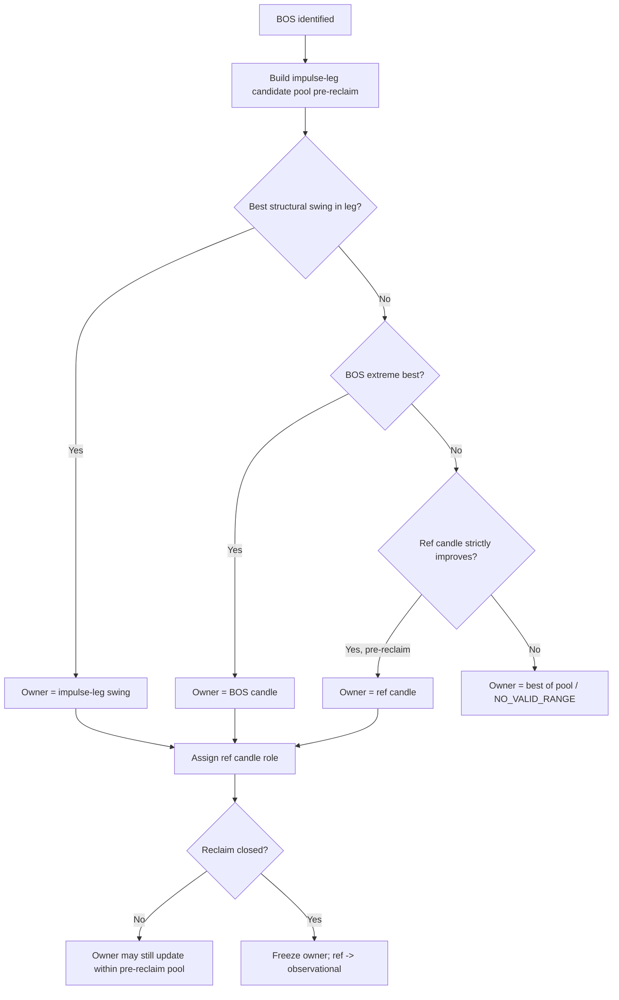

# HTF Reference Structure Doctrine

**Status:** PLAN ONLY — not implemented  
**Date:** 2026-06-17  
**Scope:** How higher-timeframe (HTF) reference structures determine RH/RL ownership for `RANGE_V2`.  
**Out of scope:** Detector code, Electron UI, backend API, stats/analytics.

---

## 1. Purpose

FX TrendMaster ranges are **event-driven containers**. At HTF (W1, D1, etc.), a single candle rarely tells the full story. A **reference structure** is the ordered candle sequence around a structural break that establishes:

- which candle **owns** RH or RL (durable boundary price + market time),
- which candle is **ref** (reaction / confirmation participant),
- which candles are **observational only** (confirm without owning the extreme).

This document locks that vocabulary and the ownership rules so `RANGE_V2` boundary selection can align with Josh’s audited mapping practice (see `docs/fixtures/detector_audit_4750e5ac_rh_doctrine_report.md`).

**Hard rule:** A ref structure is **not always one candle**. It may span:

| Role | Meaning |
|------|---------|
| **BOS candle extreme** | Wick/body break of the prior container boundary |
| **Ref candle** | First qualifying reaction candle after BOS (may or may not own the extreme) |
| **Continuation confirmation** | Later candle(s) that validate the ref structure without superseding boundary ownership |

Ref structures are **HTF lifecycle facts**. They are distinct from micro ref-candle entry pipelines (15m confirmation) but share the same vocabulary: *reference*, not *latest swing*.

---

## 2. Definitions

### 2.1 Container and boundaries

| Term | Definition |
|------|------------|
| **Container** | Active HTF range with known RH and RL (`ACTIVE_RANGE`). |
| **RH / RL** | Range high / range low — durable boundary prices with **market-time** anchors (`*_time_ms`). |
| **Old RH / Old RL** | Boundaries of the container **before** the current BOS cycle. |
| **Broken boundary** | `HIGH` or `LOW` — which side of the old container was breached. |

### 2.2 Break and reclaim

| Term | Definition |
|------|------------|
| **BOS candle** | First candle at HTF where wick (HTF doctrine) breaks the broken boundary of the old container. |
| **BOS direction** | `UP` (break above old RH) or `DOWN` (break below old RL). |
| **Reclaim** | Close back inside the old broken boundary after BOS (per `RANGE_V2_DOCTRINE_CONTRACT.md`). Wick-only return is **contact**, not reclaim, until close confirms. |
| **Impulse leg** | Candle span from the last opposite-boundary anchor through the BOS candle — the displacement leg that defines the break context. |

### 2.3 Reference structure (core)

| Term | Definition |
|------|------------|
| **HTF reference structure** | The minimal ordered tuple around a BOS: `{ bos_candle, ref_candle?, continuation_candles[] }` plus ownership verdict for RH/RL. |
| **Ref candle** | The **first candle after the BOS candle** that qualifies as the structural reaction candle for this cycle. Default slot: `bos_index + 1` on the HTF series. May be reassigned if that candle is a gap/placeholder and the next HTF bar is the first tradeable reaction. |
| **Ref participation** | Ref candle is part of the structure even when it does **not** engulf, sweep, or exceed the BOS extreme. Participation = rejection / inside / shallow counter-bar that defines the ref zone. |
| **Boundary owner** | The single candle (by market time) whose extreme price is promoted as `suggested_rh` or `suggested_rl`. |
| **Observational ref** | Ref candle recorded for reclaim / continuation semantics but **does not** own RH/RL. |

### 2.4 Ownership verbs

| Verb | Meaning |
|------|---------|
| **Owns** | Boundary price and `*_time_ms` are taken from this candle’s extreme. |
| **Participates** | Candle is stored in ref structure trace; may influence reclaim/ref confirmation flags. |
| **Confirms** | Wick contact or close validates structure; does not change boundary owner unless doctrine explicitly promotes (rare; see §6). |

### 2.5 Relationship to RANGE_V2 RH doctrine (audit-backed)

2025 XAUUSD W1 audit (`4750e5ac`) supports **impulse-leg ceiling** for RH on bullish transitions:

- Josh’s `suggested_rh_time_ms` aligned with `range_end_time` in **10/10** EDIT / `WRONG_RH` weeks.
- Josh RH was **never** post-reclaim in that slice.
- Detector error mode: RH ≡ BOS-bar high (`retracement_impulse_high`) when a **higher pre-reclaim impulse-leg swing** should own RH.

**Implication for this doctrine:** BOS candle **may** own RH/RL, but must **not** own by default. Ownership follows §5 rules; ref structure supplies the evidence.

---

## 3. Boundary ownership rules (summary)

### 3.1 Default ownership matrix

| Transition | Broken side | Primary boundary to rebase | Default owner candidates (priority order) |
|------------|-------------|----------------------------|----------------------------------------|
| Bullish BOS UP | `HIGH` | **RH** (new ceiling context) | 1) Highest structural high in **impulse leg** (incl. pre-BOS swings) → 2) BOS candle high → 3) Ref candle high **only if** it exceeds prior owner and is still pre-reclaim |
| Bullish BOS UP | `HIGH` | **RL** (opposite) | Opposite swing low linked to transition (not ref structure) — per `RANGE_V2_DOCTRINE_CONTRACT.md` §5.1 |
| Bearish BOS DOWN | `LOW` | **RL** (new floor context) | 1) Lowest structural low in **impulse leg** → 2) BOS candle low → 3) Ref candle low **only if** it exceeds prior owner (deeper) and is still pre-reclaim |
| Bearish BOS DOWN | `LOW` | **RH** (opposite) | Opposite swing high linked to transition — per §5.2 |

**Ref candle default:** observational for the **broken-side** boundary unless its extreme **strictly improves** the doctrinal owner among pre-reclaim candidates.

### 3.2 Pre-reclaim vs post-reclaim

| Phase | Boundary updates |
|-------|------------------|
| After BOS, before reclaim | Broken-side owner may be assigned from impulse leg + BOS + ref (pre-reclaim pool only). |
| After reclaim close | Broken-side owner is **frozen** for this cycle; ref structure moves to observational / confirmation role for rebase completion. |
| Post-reclaim highs/lows | **Do not** automatically become RH/RL (audit: 0/10 post-reclaim RH). May affect **next** cycle’s seed context only after promotion. |

### 3.3 Engulf, sweep, inside bar

| Ref candle shape | Owns extreme? | Participates? |
|------------------|---------------|---------------|
| Engulfs BOS body | Only if extreme beats impulse-leg owner | Yes |
| Sweeps BOS wick then closes back | Usually **no** ownership (wick contact); see Case 4 | Yes |
| Inside bar (no new extreme) | **No** | Yes — Case 3 |
| Continuation in break direction | May own only if still pre-reclaim and beats impulse-leg high/low | Yes |

---

## 4. Bullish examples (BOS UP)

### Case 1 — BOS candle makes RH; next candle is ref

**Setup:** Active W1 container. Price breaks above old RH on candle **B** (BOS UP).

```text
Candle index:  ...  [A]     [B] BOS      [C] ref       [D] reclaim?
                 swing   break old RH   bearish react   close <= old RH
```

| Field | Value |
|-------|-------|
| `broken_boundary` | `HIGH` |
| `bos_candle` | B |
| `ref_candle` | C (first reaction after B) |
| **RH owner** | **B** — BOS candle high, when no higher impulse-leg swing exists before B |
| **RL owner** | Opposite swing low before B (linked transition swing) |
| Ref role | Observational for RH; establishes ref zone for reclaim watch on C |

**RANGE_V2:** `selected_rh_source = BOS_BAR` or `STRUCTURAL_SWING_IMPULSE_LEG` depending on whether a higher pre-B swing exists. `htf_ref_structure.ref_candle_index = C`, `ref_ownership = OBSERVATIONAL`.

---

### Case 3 — Ref participates without engulf or sweep

**Setup:** BOS UP on **B**. **C** is a small inside / shallow bearish bar: no new high, no sweep of B’s high.

```text
[B] high = 2720 (BOS)
[C] high < B.high, low > B.low  (inside)
```

| Verdict | Detail |
|---------|--------|
| RH owner | Still **B** (or impulse-leg swing if higher — audit Case 06-15: owner **below** BOS bar) |
| Ref | **C participates** — `ref_participation = INSIDE_REACTION` |
| Ref owns RH? | **No** — no new extreme |

**Why it matters:** Ref candle is required for structure narrative and reclaim gating even when it does not move the boundary.

---

### Case 4 — Wick contact / reclaim; ref does not own extreme

**Setup:** BOS UP on **B**. **C** wicks above old RH but **closes back inside** old RH (reclaim touch). **D** may close confirm. B’s high remains the impulse-leg ceiling.

```text
old RH -------- ref reclaim line
[B] wick breaks, high = candidate RH
[C] wick tags / pierces, close <= old RH  → reclaim contact
```

| Verdict | Detail |
|---------|--------|
| RH owner | **B** (or pre-B impulse swing per audit), **not C** |
| Ref / reclaim | C = `reclaim_touch` candidate; ownership unchanged |
| `reclaim_confirmation` | `RECLAIM_TOUCH` on wick; `RECLAIM_CLOSE` when close inside |

**RANGE_V2:** Separate `reclaim_candle_index` from `rh_owner_candle_index`. Never promote RH to reclaim candle merely because it touched.

---

### Bullish audit-shaped example (impulse leg > BOS bar)

**Setup:** W1 2025-06-15 pattern. BOS bar high 3446.72 but Josh RH 3430.86 @ prior week (`range_end`).

| Verdict | Detail |
|---------|--------|
| RH owner | **Impulse-leg swing** (week ending 2025-06-08), not BOS candle |
| Doctrine | Case 1 variant — BOS does **not** own when a doctrinal impulse-leg swing is the ceiling |
| Ref candle | May still be observational on bar after BOS |

This is the audit proof that **default BOS-bar RH is wrong**.

---

## 5. Bearish examples (BOS DOWN)

### Case 2 — BOS candle makes RL; next candle is ref

**Setup:** Active container. Price breaks below old RL on candle **B** (BOS DOWN).

```text
Candle index:  ...  [A]     [B] BOS      [C] ref       [D] reclaim?
                 swing   break old RL   bullish react   close >= old RL
```

| Field | Value |
|-------|-------|
| `broken_boundary` | `LOW` |
| `bos_candle` | B |
| `ref_candle` | C |
| **RL owner** | **B** — BOS candle low when no lower impulse-leg swing exists |
| **RH owner** | Opposite swing high linked to transition |
| Ref role | Observational for RL; ref zone for reclaim watch |

---

### Case 3 (bearish) — Inside ref after BOS DOWN

**Setup:** BOS DOWN on **B**. **C** is inside bar.

| Verdict | Detail |
|---------|--------|
| RL owner | **B** (or deeper impulse-leg low if present) |
| Ref | C participates, does not own RL |

---

### Case 4 (bearish) — Wick reclaim; ref does not own RL

**Setup:** BOS DOWN on **B**. **C** wicks below old RL, closes back inside.

| Verdict | Detail |
|---------|--------|
| RL owner | **B** (or impulse-leg low), not C |
| Reclaim | Wick contact on C; close confirm separate |

---

## 6. When BOS candle owns RH/RL

BOS candle owns the **broken-side** boundary **only when all** are true:

1. **No higher (bullish) or lower (bearish) structural swing** exists in the impulse leg before reclaim.
2. BOS extreme is the **best pre-reclaim** candidate in the bounded candle window.
3. Reclaim has **not** yet closed (ownership freezes after reclaim for this cycle).

| Owns RH (BOS UP) | Owns RL (BOS DOWN) |
|------------------|---------------------|
| BOS high is impulse-leg ceiling | BOS low is impulse-leg floor |
| Typical when break bar is the displacement climax | Typical when break bar is the sell climax |
| **Counter-example:** audit 2025-06-15 — RH owner **below** BOS high → BOS does **not** own |

---

## 7. When ref candle owns RH/RL

Ref candle owns the broken-side boundary **only when all** are true:

1. Ref is the **first qualifying reaction candle** after BOS (`ref_candle_index = bos_index + 1` or doctrine-adjusted slot).
2. Ref extreme **strictly improves** the boundary vs current owner (higher for RH, lower for RL).
3. Event is still **pre-reclaim** (same cycle, before reclaim close).
4. Ref move is **structural**, not a reclaim wick alone (Case 4 exclusion).

| Owns RH | Owns RL |
|---------|---------|
| Ref high > owned RH after BOS UP | Ref low < owned RL after BOS DOWN |
| Rare at HTF when BOS is the displacement bar | Rare; often ref is counter-trend |

**Default:** ref does **not** own — it **participates** (Cases 1–3).

---

## 8. When ref candle is observational only

Ref is **observational** when any of:

| Condition | Example |
|-----------|---------|
| Inside bar / no new extreme | Case 3 |
| Wick reclaim / sweep without close ownership transfer | Case 4 |
| Reclaim already closed — ref frozen for trace | Post-reclaim |
| Ref extreme loses to impulse-leg or BOS owner | Audit weeks Jan–Aug |
| Continuation candle confirms narrative but does not beat owner | Later bars in same cycle |

Observational refs are still **stored** in `meta_json` (`htf_ref_structure`) for:

- reclaim suggestion gating,
- user review narrative,
- future stats (out of scope here).

They must **not** silently move `suggested_rh` / `suggested_rl`.

---

## 9. How this affects RANGE_V2 RH/RL selection

### 9.1 Pipeline insertion

```text
SWING_V* → BOS_V* → HTF_REF_STRUCTURE_RESOLVE → RECLAIM_V* → BOUNDARY_V2 → RANGE_V2 suggestion
```

`HTF_REF_STRUCTURE_RESOLVE` is a **planning step** (not yet coded). It emits ownership verdicts consumed by `range_boundary.py` / `RANGE_V2`.

### 9.2 Broken-side vs opposite-side

| Side | Selector |
|------|----------|
| **Broken-side** (RH on BOS UP, RL on BOS DOWN) | HTF ref structure + impulse-leg doctrine (§3, §6–8) |
| **Opposite-side** (RL on BOS UP, RH on BOS DOWN) | Existing opposite-swing linkage (`RANGE_V2_DOCTRINE_CONTRACT.md` §5.3) — **not** ref candle |

### 9.3 Replacing the audit failure mode

| Current wrong behavior | Target behavior |
|------------------------|-----------------|
| RH = `retracement_impulse_high` ≡ BOS bar always | RH = `htf_boundary_owner` from impulse leg, BOS, or ref per §5–7 |
| `boundary_selection_reason` names RL rule only | Distinct `selected_rh_source` / `selected_rl_source` |
| Single-candle BOS index reused across scan steps | Per-cycle BOS + ref indices tied to **market time** |

### 9.4 Alignment with locked RANGE_V2 sequence

HTF ref structure **does not replace** BOS → reclaim → opposite boundary. It **refines** who owns the broken-side extreme before reclaim freezes the container.

```text
SEED / ACTIVE_RANGE
  → BREACHED_* (BOS candle identified)
  → HTF_REF_STRUCTURE (bos + ref roles assigned)
  → RECLAIMED_* (reclaim candle; owners frozen)
  → REBASED (suggested RH/RL emitted with trace)
```

### 9.5 `NO_VALID_RANGE` triggers

Emit `NO_VALID_RANGE` when:

- BOS candle cannot be identified in replay window,
- Ref slot is ambiguous **and** ownership cannot be resolved,
- Broken-side owner would require a candle after `replay_until_time`,
- Impulse-leg window truncates away the true owner (replay bug — fix window, not doctrine).

---

## 10. Required `meta_json` trace (future implementation)

Every `RANGE_V2` suggestion that depends on HTF ref structure should carry:

### 10.1 Core ref structure block

```json
"htf_ref_structure": {
  "schema_version": "htf_ref_structure_v1",
  "source_timeframe": "W1",
  "structure_layer": "WEEKLY",
  "bos_direction": "UP",
  "broken_boundary": "HIGH",
  "bos_candle_index": 103,
  "bos_candle_time_ms": 1736640000000,
  "bos_extreme_price": 2697.75,
  "ref_candle_index": 104,
  "ref_candle_time_ms": 1737244800000,
  "ref_candle_role": "OBSERVATIONAL",
  "ref_participation": "INSIDE_REACTION",
  "continuation_candle_indices": [],
  "impulse_leg_start_time_ms": 1735430400000,
  "impulse_leg_end_time_ms": 1736640000000
}
```

### 10.2 Boundary ownership block

```json
"boundary_ownership": {
  "rh_owner_candle_index": 102,
  "rh_owner_time_ms": 1736035200000,
  "rh_owner_price": 2726.06,
  "rh_owner_reason": "STRUCTURAL_SWING_IMPULSE_LEG",
  "rl_owner_candle_index": 101,
  "rl_owner_time_ms": 1735430400000,
  "rl_owner_price": 2586.4,
  "rl_owner_reason": "OPPOSITE_SWING_BEFORE_BOS",
  "ownership_frozen_at": "RECLAIM_CLOSE",
  "ownership_frozen_time_ms": 1737244800000
}
```

### 10.3 Integration with existing RANGE_V2 fields

| Field | Relationship |
|-------|--------------|
| `selected_rh_source` / `selected_rl_source` | Mirror `rh_owner_reason` / `rl_owner_reason` enums |
| `boundary_trace.boundary_candidates_considered` | Must list BOS bar, impulse-leg swings, ref extreme (if any) |
| `boundary_trace.rejected_boundary_candidates` | e.g. `POST_BOS_RETRACEMENT`, `RECLAIM_CANDLE_NOT_OWNER`, `BOS_BAR_SUPERSEDED` |
| `broken_boundary` | Same as `htf_ref_structure.broken_boundary` |
| `reclaim_candle_index` | May equal ref index in Case 4; still **distinct** from owner index |
| `reclaim_confirmation` | `RECLAIM_TOUCH` \| `RECLAIM_CLOSE` |
| `range_start_time` / `range_end_time` | `range_end` should align with broken-side owner week when owner is impulse-leg ceiling (audit 10/10) |
| `suggested_rh_time_ms` / `suggested_rl_time_ms` | Must equal owner candle market time, not merely replay_until |

### 10.4 Enum vocabulary (locked for planning)

**`ref_candle_role`:** `OBSERVATIONAL` \| `OWNS_BROKEN_SIDE` \| `RECLAIM_AGENT`

**`ref_participation`:** `STANDARD_REACTION` \| `INSIDE_REACTION` \| `WICK_SWEEP` \| `CONTINUATION` \| `NONE`

**`rh_owner_reason` / `rl_owner_reason`:** `BOS_BAR` \| `STRUCTURAL_SWING_IMPULSE_LEG` \| `STRUCTURAL_SWING_CEILING_BEFORE_BOS` \| `STRUCTURAL_SWING_FLOOR_BEFORE_BOS` \| `REF_CANDLE_EXTREME` \| `OPPOSITE_SWING_BEFORE_BOS` \| `SEED_ANCHORED`

---

## 11. Decision flow (broken-side ownership)



---

## 12. Non-goals (this document)

| Item | Status |
|------|--------|
| Detector implementation | Not authorized |
| Electron ref-zone UI | Not authorized |
| 15m micro ref entry rules | Separate pipeline |
| Seed-chain / scan bootstrap fixes | Separate phase (Phase 3 pre-check) |
| Parent/container HTF overlap (doctrine C) | Needs more audit data |
| Threshold tuning | Forbidden |

---

## 13. References

| Document | Relevance |
|----------|-----------|
| `docs/architecture/RANGE_V2_DOCTRINE_CONTRACT.md` | BOS → reclaim → opposite boundary sequence |
| `docs/fixtures/detector_audit_4750e5ac_rh_doctrine_report.md` | Audit proof: impulse-leg RH, not BOS bar default |
| `docs/fixtures/detector_rh_analysis.md` | Detector RH = `retracement_impulse_high` failure mode |
| `electron/README_ELECTRON_V087_15_HTF_CORE_STATE_CONTRACT.txt` | HTF lifecycle; ref separate from BOS/reclaim |
| `electron/README_ELECTRON_V087_10_HTF_STATE_MEMORY_REBASE.txt` | Rebase after BOS + reclaim; old range preserved |
| `docs/architecture/ARCHITECTURE_LOCK.md` | Raw ledger vs detector vs confirmed truth |

---

## 14. Review checklist (before implementation)

| # | Question | Expected answer |
|---|----------|-----------------|
| 1 | Can ref structure be a single candle? | Only degenerately; default is multi-candle tuple |
| 2 | Does ref candle always own RH on BOS UP? | **No** — default observational |
| 3 | Does BOS candle always own RH on BOS UP? | **No** — impulse-leg swing may own (audit) |
| 4 | Can reclaim wick change RH owner? | **No** — confirm only (Case 4) |
| 5 | Is post-reclaim high the RH? | **No** for this HTF doctrine (audit 0/10) |
| 6 | Must meta_json trace owners separately from reclaim? | **Yes** |

**Gate:** Implementation waits on Josh review of this plan + existing `RANGE_V2` lock. No code until explicit approval.
